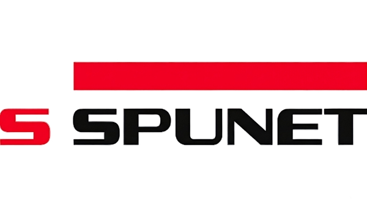

<div align="center">
  

  # SPUNET

  **UNET model and training data used to used to detect impurities in samples of wood chips.**

  [](https://opensource.org/licenses/MIT)
  
</div>

---

## Overview
SPUNET ...

## Installation


```bash
# Clone the repository
git clone [https://github.com/MendedBiscuit/spunet.git](https://github.com/MendedBiscuit/spunet.git)

# Navigate to the directory
cd spunet

# Initiate venv and install dependencies using uv
uv venv
uv pip install -r requirements.txt
